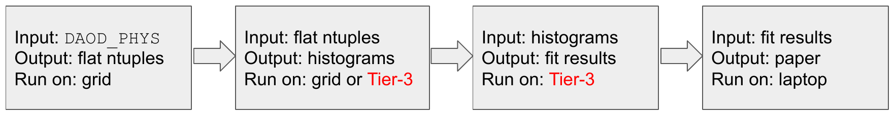

In this episode, we'll introduce the concept of a "Shared Tier-3", and how you can use it.

# Computing Centers in ATLAS

ATLAS has "tiered" computing facilities:

- Tier-0: CERN-hosted resources that perform first-pass processing of detector data.  Used for calibrations and initial event reconstruction.  Users do not run jobs here.
- Tier-1: Several Tier-1's located throughout the world; in the US, we have a Tier-1 at Brookhaven National Lab.  Large facilities used for grid computing.  Used for both production jobs and user jobs.  No interactive access for users.
- Tier-2: Many Tier-2's located throughout the world, several in the US.  From the user point of view, these are indistinguishable from Tier-1's.
- Tier-3: Equivalent of institutional clusters.  Usually there is no grid access, and users need to be granted permission to access them.  They provide interactive access in addition to local batch clusters and storage.  (Similar to `lxplus` at CERN.)

Our focus will be on the Tier-3's, which are most effectively used for processing flat ntuples:

In the US, a lot of institutions have mini-clusters with access restricted to institutional users.  These were especially common in the early days of ATLAS, but as that hardware aged, the facilities became increasingly challenging to maintain and grow to support the needs of today's analyzers.

In response to this, US-ATLAS has set up three shared facilities, where any US-ATLAS user can get access to computing resources that go well beyond what a single institute would commonly provide.  All shared tier-3's include (or will include):

- Interactve login nodes for software development
- Access to at least 1000 CPU cores per site in a batch system
- Access to large amounts of local storage
- Access to GPU's
- Jupyter notebook support
- 

The University of Chicago Shared Tier-3 is the Analysis Facility we're using for this bootcamp, so you should already have access to a Shared tier-3!

# Shared Tier-3's in the US

There are two other shared tier-3 facilities in the US: one at SLAC National Laboratory, the other at Brookhaven National Laboratory.

- The BNL Tier-3 is part of a larger computing facility at the SDCC at BNL.
-- ATLAS has priority for approximately 2000 cores available in a condor queue
--- If the rest of the facility has free slots, then ATLAS jobs can spill over into an additional >30k cores 
-- Users have access to 500 GB of disk space, plus an additional 5 TB of dCache space
-- Interactive logins via shells
-- Jupyter Notebooks: [https://jupyter.sdcc.bnl.gov/](https://jupyter.sdcc.bnl.gov/)
--- More available as part of a shared filesystem (`pnfs`) for group work
- The SLAC Tier-3 is also part of a shared pool at SLAC
-- ATLAS has priority for ~1200 cores, potential access up to 15k cores
-- 100 GB home space plus 2-10 TB for data
-- Interactive logins via shells
-- Jupyter Notebooks: [https://sdf.slac.stanford.edu/public/doc](https://sdf.slac.stanford.edu/public/doc/#/)

Both facilities also allow users to access to GPU's for machine learning and likelihood fits.

It can take some time (weeks or months) to complete all the necessary steps to register at BNL or SLAC.  Suggest that you start now, and get the accounts before you think you might need them!

For more details, see the [US-ATLAS Shared Tier-3 documentation](https://usatlas.readthedocs.io/projects/af-docs/en/latest/).



