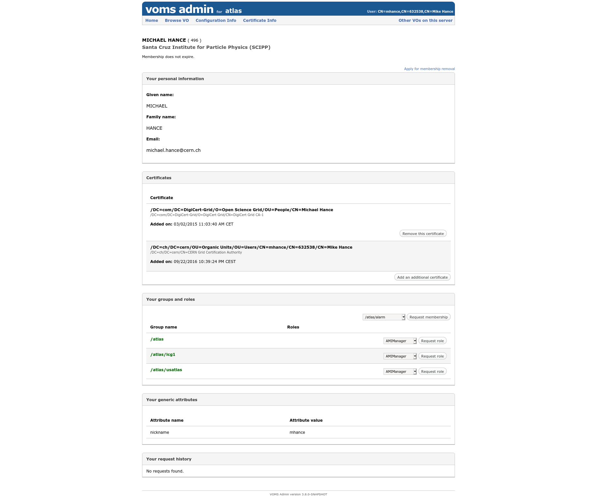
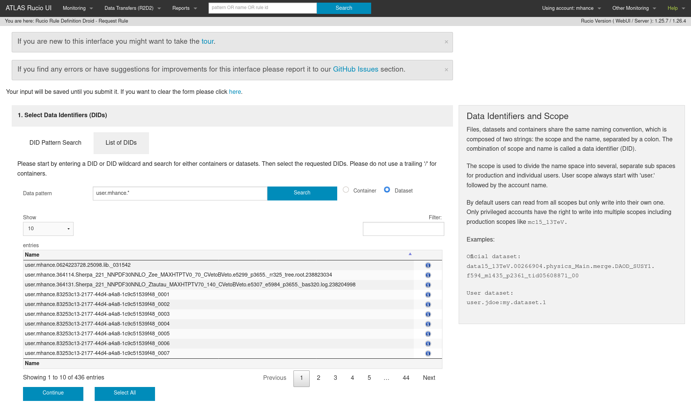
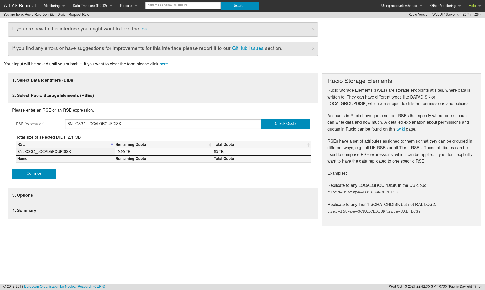
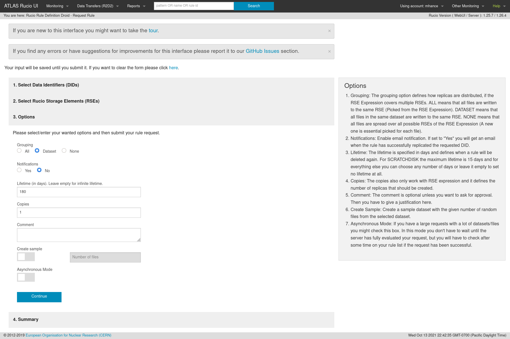
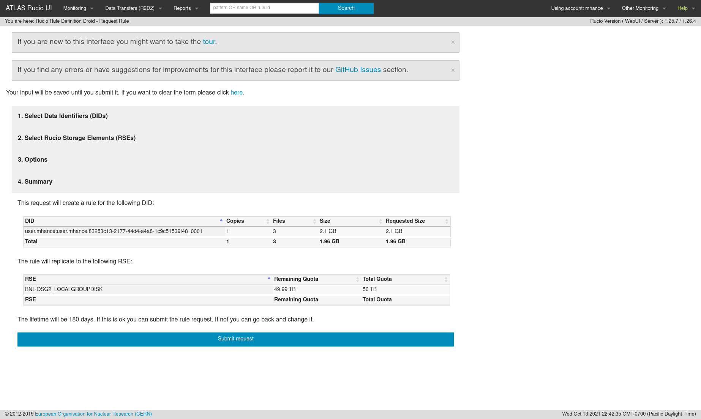
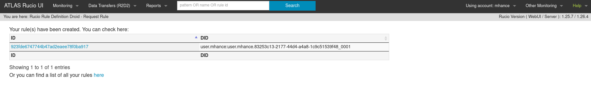

Go to the [LCG VOMS page](https://lcg-voms2.cern.ch:8443/voms/atlas):

In the "Your groups and roles" section, request membership for the `/atlas/usatlas` role.  It may take a few days to be approved, but once it is then you have access to grid storage in the US!

Once you have that role, navigate to the R2D2 page: [https://rucio-ui.cern.ch/r2d2](https://rucio-ui.cern.ch/r2d2/request)



