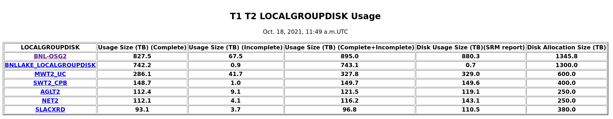
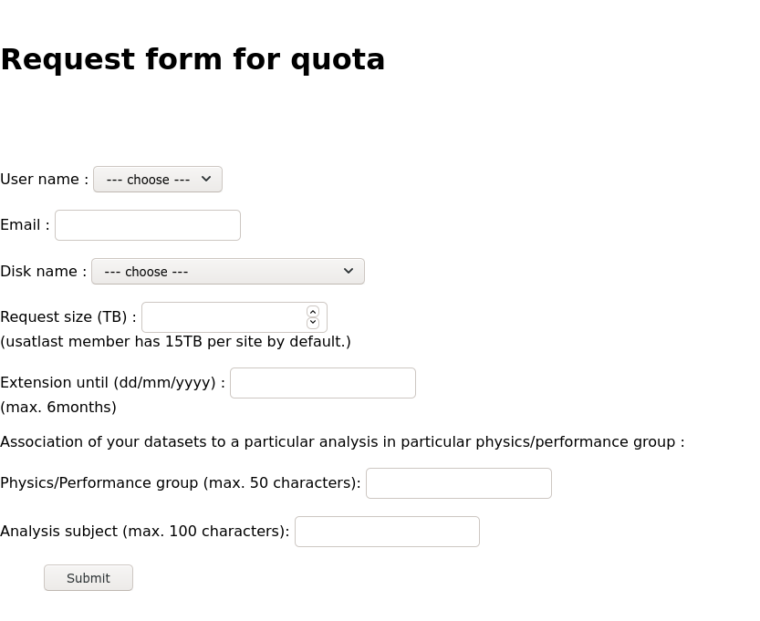

# `LOCALGROUPDISK` overview

ATLAS provides grid storage in a number of different flavors

- `DATADISK`: this is disk space reserved for official ATLAS samples, either data or MC.
- `SCRATCHDISK`: when you run grid jobs, often the outputs will be stored on a `SCRATCHDISK` at the site your jobs ran.  Data on these disks are deleted regularly (every week or two)
- `LOCALGROUPDISK`: national or institutional resources that are restricted to users with the appropriate VOMS role assigned to their grid certificate.
- ... and others!

For many people, their grid computing model is to:

1. Submit jobs to the grid
1. When jobs are done, download them to local computing resources (or eos, etc) using `rucio get`
1. Not be concerned when the grid copies of their data are deleted

However, if the dataset is large, or shared with many people, it can be advantageous to move the data using `R2D2` rules instead of `rucio get`, and to host a single copy rather than requiring everyone to download their own copy.  This is where US-ATLAS `LOCALGROUPDISK`s come in!

If you have the `/atlas/usatlas` role assigned to your grid certificate, you can store your data on any US `LOCALGROUPDISK`.  Currently the quota for any user is 15 TB on a single `LOCALGROUPDISK`, or slightly more if the data are spread across several.   There's lots of available space in the disks:

So, for example, there are `LOCALGROUPDISK`s attached to BNL, SLAC, and MWT2, which are all co-located with our shared Tier-3 facilities, making either direct access or access via `xrootd` fairly easy.  (See documentation on the shared tier-3's for site-specific instructions to access data on the associated `LOCALGROUPDISK`.)

# Getting the `/atlas/usatlas` role

Go to the [LCG VOMS page](https://lcg-voms2.cern.ch:8443/voms/atlas):

In the "Your groups and roles" section, request membership for the `/atlas/usatlas` role.  It may take a few days to be approved, but once it is then you have access to grid storage in the US!  This means you can store your datasets in US LOCALGROUPDISK endpoints.  This is nice, because:

1. otherwise your user data on the grid will be deleted fairly soon after you make it (on the assumption that you've downloaded it to local storage already).  On the other hand, if it's in a LOCALGROUPDISK, it never expires!  (It is a shared resource though, so we will ask you to clean up unused data sets after a while.)
2. the Shared Tier-3's can read data directly from their own LOCALGROUPDISKs, without needing to download the data manually.

# Moving data into the `LOCALGROUPDISK`

Once you have that role, the next step is to request that your favorite datasets be replicated on a LOCALGROUPDISK.  Navigate to the R2D2 page: [https://rucio-ui.cern.ch/r2d2](https://rucio-ui.cern.ch/r2d2/request)

- Log in with your X509 certificate:

- Find the datasets you'd like to replicate.  

- Choose which LOCALGROUPDISK you want to use.
-- `BNL-OSG2_LOCALGROUPDISK` is the right endpoint for BNL.  `BNL-OSG2_SCRATCHDISK` can be used if you only need the data to be there for a few days or a week.
-- `SLACXRD_DATADISK`, `SLACXRD_LOCALGROUPDISK` and `SLACXRD_SCRATCHDISK` are all possible endpoints for SLAC.

- Make sure to set the lifetime -- leave blank for data that shouldn't expire!

- Submit your request

- ...  and now the rule exists!  It may take a day or so for the transfer to occur, depending on how big the dataset is.

# Getting more space

If you need more space on the `LOCALGROUPDISK` at your facility, or just need more space in general for a short period of time, you can request a temporary increase in your allocation at [https://atlas-lgdm.cern.ch/LocalDisk_Usage/USER/RequestFormUsage/](https://atlas-lgdm.cern.ch/LocalDisk_Usage/USER/RequestFormUsage/).

Note that the increase in space is expected to be temporary, and we will come back to ask you to clean up once the extension period has passed!



